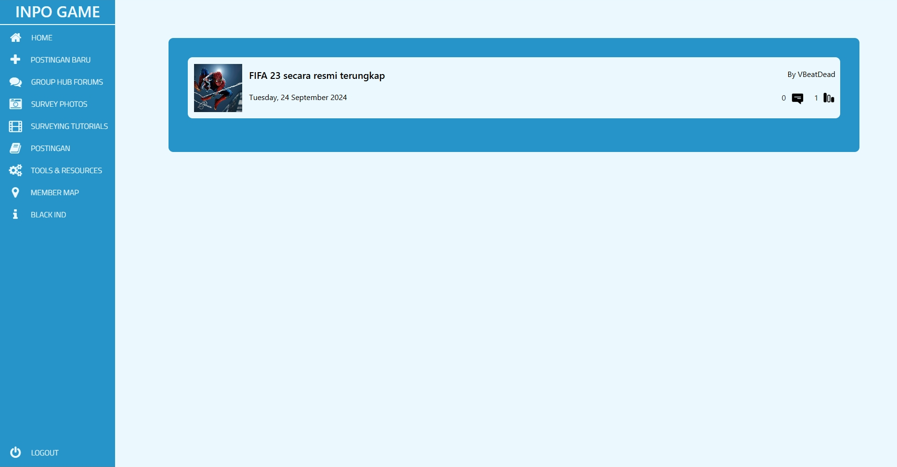

### ReCore - Simple News Website

**ReCore** is a basic web application built with Laravel that allows users to create, manage, and view news articles related to gaming. This project was created as a learning exercise in web development, focusing on the fundamentals of PHP, Laravel, and modern web technologies.

  
*Admin panel interface allows for easy management of news articles.*

#### Features:
- User authentication (login and registration)
- CRUD operations for news articles (create, read, update, delete)
- Image upload for news articles with base64 encoding
- Rich-text editor integration (TinyMCE) for writing detailed news articles
- Responsive design using Bootstrap

#### Technologies Used:
- Laravel (PHP framework)
- MySQL (Database)
- TinyMCE (Rich-text editor)
- Bootstrap (CSS framework)
- JavaScript (jQuery)

#### Setup Instructions:
1. Clone the repository:
   ```bash
   git clone https://github.com/VBeatDead/ReCore
   ```

2. Install dependencies:
   ```bash
   composer install
   npm install
   ```

3. Copy `.env.example` to `.env` and update environment variables:
   ```bash
   cp .env.example .env
   ```

4. Generate application key:
   ```bash
   php artisan key:generate
   ```

5. Run migrations:
   ```bash
   php artisan migrate
   ```

6. Seed the database (optional but recommended for demo data):
   ```bash
   php artisan db:seed
   ```

   The seeder will create an admin account with the following credentials:
   - **Email**: `admin@game.com`
   - **Password**: `admin123`

7. Start the development server:
   ```bash
   php artisan serve
   ```

Feel free to customize and expand upon this project for further learning or to suit your needs!
